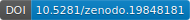

# data-vs-architecture

**Code DOI:** [](https://doi.org/10.5281/zenodo.19848180)  

Code repository for the analysis pipeline used in the study:

> **Training data provenance, not architecture, is the primary determinant of performance on a materials discovery benchmark.**
> Y. Ma, W. Li, C. Zhang, H. Zhao, N. Zhang, L. Yao, P. Kang, J. Yun.
> Manuscript under peer review at *Nature Communications*.

The repository contains the full analysis pipeline that re-evaluates 45 published machine-learning models on the Matbench Discovery benchmark (256,963 WBM structures), including variance decomposition, error-correlation clustering, scaling-law fits, collective-failure decomposition, and Pareto-frontier analysis.

## Requirements

- Python `3.11`
- [`uv`](https://docs.astral.sh/uv/) for dependency management
- ~5 GB free disk space for inputs and intermediate outputs

## Setup

```bash
git clone https://github.com/ghorges/data_vs_architecture.git
cd data_vs_architecture
uv sync
```

This installs all pinned dependencies from `uv.lock` (NumPy, pandas, scikit-learn, statsmodels, scipy, pymatgen, matplotlib, seaborn, etc.).

## Data

All inputs are publicly hosted and can be downloaded with the included script:

```bash
uv run python scripts/download_inputs.py
```

This populates the local input cache under `data/raw/` with:

- Per-material predictions for the 45 models (from the [Matbench Discovery repository](https://matbench-discovery.materialsproject.org))
- WBM test set summary table
- Matbench Discovery model metadata and dataset descriptors

The full pipeline then writes derived tables to `data/processed/`, analysis outputs to `results/`, and external reference assets to `external/` where needed. These directories are intentionally committed as empty placeholders; they are populated by `download_inputs.py` and `run_evidence_pipeline.py`.

The frozen 45-model snapshot, intermediate analysis outputs, and figure-ready tables are archived on Figshare:

> Data DOI: https://doi.org/10.6084/m9.figshare.31884946

To use the Figshare archive instead of regenerating everything, download the archive and unpack the `data/`, `results/`, and `external/` contents into the repository root, preserving the directory names above.

## Code Availability

The source code is available on GitHub and archived on Zenodo:

- GitHub: https://github.com/ghorges/data_vs_architecture
- Code DOI: https://doi.org/10.5281/zenodo.19848180

## Reproducing the Analysis

List all available evidence-pipeline targets:

```bash
uv run python scripts/run_evidence_pipeline.py --list
```

Run the full default pipeline (regenerates all tables, JSON summaries, and main-text figures):

```bash
uv run python scripts/run_evidence_pipeline.py
```

For a minimal check of the primary conclusion, run the pipeline through the variance-decomposition step:

```bash
uv run python scripts/run_evidence_pipeline.py --to-step analysis_01_variance_decomposition
```

Individual analyses can be invoked directly. For example, to reproduce the main variance-decomposition result (Fig. 2a):

```bash
uv run python scripts/analysis_01_variance_decomposition.py
```

To regenerate all main-text figures:

```bash
uv run python scripts/figure_01_study_overview.py
uv run python scripts/figure_02_variance_controls.py
uv run python scripts/figure_03_scaling_laws.py
uv run python scripts/figure_04_collective_failures.py
uv run python scripts/figure_05_pareto_strategy.py
```

## Repository Structure

```
data_vs_architecture/
├── src/dva_project/         # Shared library code (loaders, statistics, plotting helpers)
├── scripts/
│   ├── download_inputs.py                          # Fetch all public input data
│   ├── freeze_snapshot_45.py                       # Define the frozen 45-model snapshot
│   ├── prepare_prediction_matrix.py                # Build per-material error matrix
│   ├── analysis_01_*.py … analysis_24_*.py         # 24 analysis modules
│   ├── build_*.py                                  # Feature/proxy/index builders
│   ├── figure_01_*.py … figure_05_*.py             # Main-text figure scripts
│   ├── figure_supplementary_batch_*.py             # Supplementary figures
│   ├── build_results_manifest.py                   # Generate evidence manifest
│   └── run_evidence_pipeline.py                    # Main orchestrator
├── data/                    # Local input and processed-data cache
├── results/                 # Analysis outputs (populated by pipeline)
├── external/                # External reference assets used by selected pipeline steps
├── pyproject.toml           # Dependency manifest
├── uv.lock                  # Pinned versions for full reproducibility
└── LICENSE                  # MIT License
```

## Mapping Analyses to Manuscript Figures and Tables

| Manuscript element | Script(s) |
|---|---|
| Fig. 1 (study overview) | `figure_01_study_overview.py` |
| Fig. 2 (variance decomposition) | `analysis_01_variance_decomposition.py`, `figure_02_variance_controls.py` |
| Fig. 3 (scaling laws) | `analysis_03_scaling_laws.py`, `figure_03_scaling_laws.py` |
| Fig. 4 (collective failures) | `analysis_04_collective_failures.py`, `figure_04_collective_failures.py` |
| Fig. 5 (Pareto frontier) | `analysis_05_resource_allocation.py`, `figure_05_pareto_strategy.py` |
| Table 1 (budget recommendations) | `analysis_05_resource_allocation.py` |
| Permutation tests | `analysis_24_permutation_significance.py` |
| Family-aware resampling | `analysis_07_family_dependence_robustness.py` |
| Bootstrap uncertainty | `analysis_08_uncertainty_resampling.py` |
| Sensitivity (53-model live state, threshold sweeps) | `analysis_06_sensitivity_checks.py` |
| Blind-spot decomposition (S6) | `analysis_09` through `analysis_22` |

## Citing This Code

If you use this code, please cite the accompanying manuscript (currently under review at *Nature Communications*) and this repository:

```
Ma, Y., Li, W., Zhang, C., Zhao, H., Zhang, N., Yao, L., Kang, P., Yun, J.
data-vs-architecture: analysis pipeline for the data-versus-architecture materials discovery study.
GitHub https://github.com/ghorges/data_vs_architecture (2026).
Zenodo https://doi.org/10.5281/zenodo.19848180.
```

## License

MIT License — see [LICENSE](LICENSE).

## Contact

For questions about the analysis pipeline, please open a GitHub issue or contact the corresponding author:

- Jiangni Yun — `yjn_calculation@163.com` (Northwest University)
